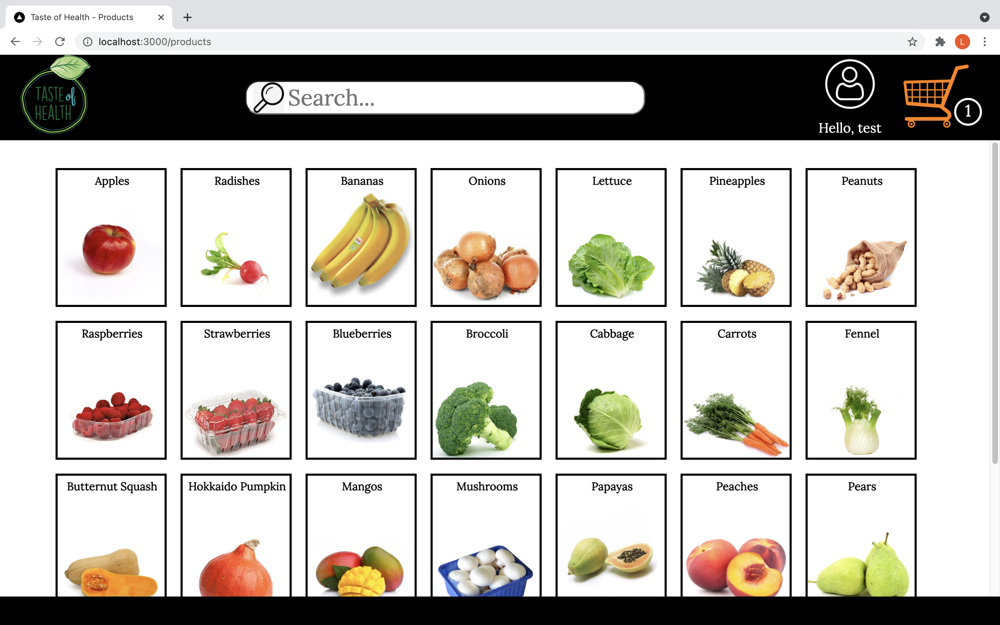

# NEXT-JS E-COMMERCE STORE

## ABOUT

E-commerce (web shop) project done in next-js using TypeScript, including a PostgreSQL database.

### Technologies

- Next.js
- Program written fully in TypeScript
- PostgreSQL database
- Styling with Emotion (css-in-js)
- Migrations (ley)
- Testing with Jest and Cypress
- React Hook Form

### Functionality

- Login / Sign Up for new users.
- Sign Up includes form validation.
- Accounts can be edited and deleted.
- The name of the currently logged in user will be shown in the header.
- Choose a product and select the desired quantity -> moved to cart
- The cart item in the header will always show the number of distinct items in the cart.
- Review you cart and change quantities for any product or remove the product from the cart. You may also delete all products there.
- Redirection to payment with Stripe (test mode). It is possible to "pay" there using one of Stripe's mock-up credit-cards.
  (E.g. VISA card 4242 4242 4242 4242, with any expiry date, names, or safety code)
- After the "purchase", a success page is shown and the cart is emptied.
- Consideration for accessibility: aria-labels were added to make the page more accessible.

### Tests

- Unit-testing with Jest
- Integration testing with Cypress
- Those tests are also performed on GitHubActions on pushes.

### Screenshots

### Set up

- Clone this repo
- Install postgres; create a new database
- Create a Stripe Account; acquire Stripe keys
- Set up any number of products on Stripe;
- Set up secrets in .env (postgres keys)
- Set up all Stripe keys in .env.local (the Stripe product keys must be stored there as well -> PRICE1= PRICE2= ....)
- Adapt randomProductId in cypress/integration/navigation.spec.ts to never equal a number greater than the number of products.
  (test may fail otherwise)
- Install dotenv-cli
- Run yarn install
- Migrate up
- Start the server (yarn dev). Runs on localhost:3000 by default.

### Deploy page

To deploy this page on Heroku, follow these steps:

- Connect your cloned repository to Heroku
- Configure Heroku Postgres as an add-on
- Set up secrets (Stripe API key and prices
- Deploy!
